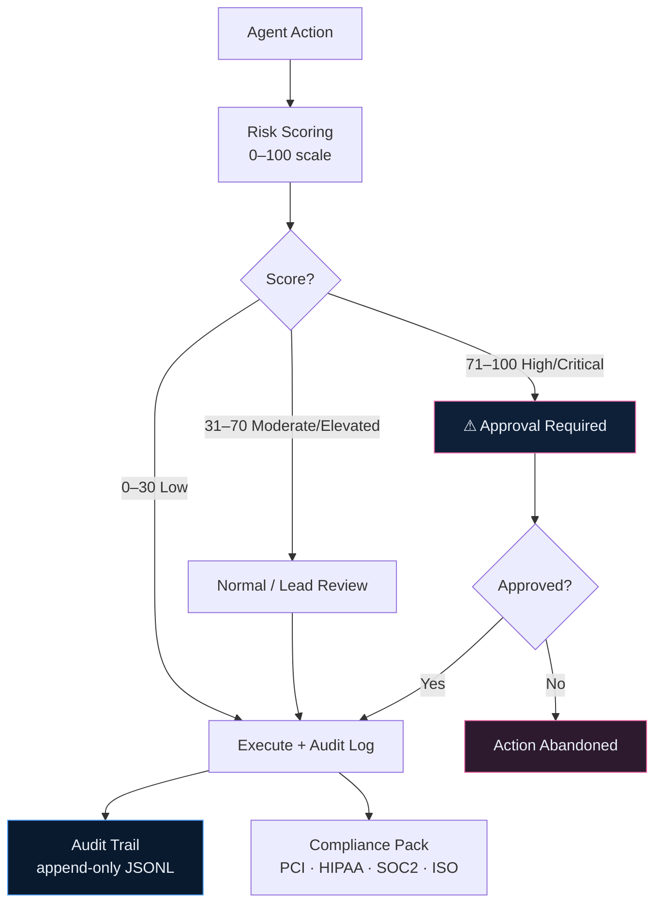
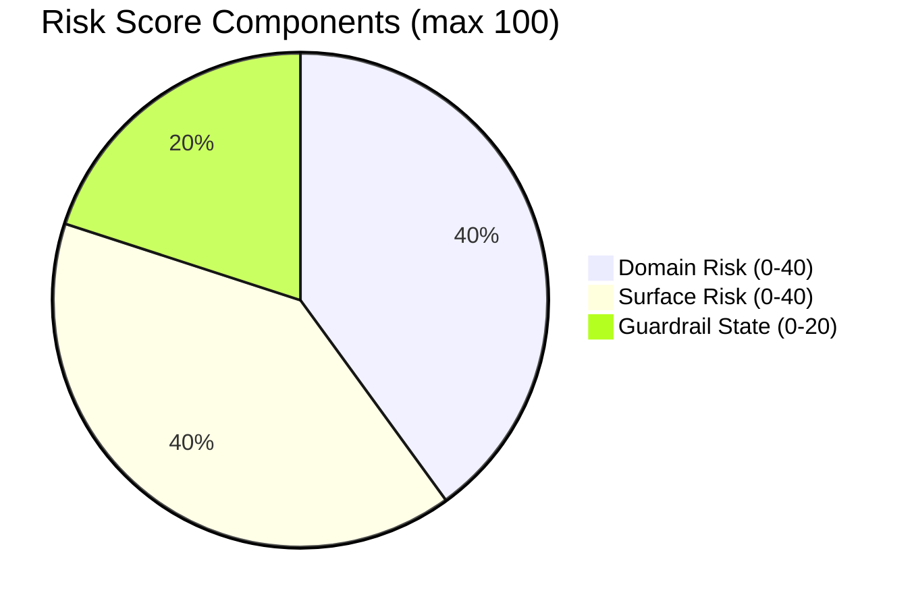

# Enterprise Governance

Velocity includes a complete enterprise governance layer designed for regulated industries and large engineering organizations.

## Overview

The governance layer provides:

| Capability                 | Description                                                  |
| -------------------------- | ------------------------------------------------------------ |
| **Audit Trail**            | Append-only JSON-L log of all agent actions (18 event types) |
| **Approval Workflow**      | In-session or PR-review sign-off for high-risk changes       |
| **Risk Scoring**           | 0–100 risk score from domain + surface + guardrail state     |
| **Compliance Packs**       | SOC2, HIPAA, PCI-DSS, ISO 27001 guardrail bundles            |
| **Workspace Intelligence** | Cross-repo dependency graph for monorepo/multi-repo orgs     |



## Audit Trail

Every significant agent action is recorded in `.velocity/artifacts/audit/audit.jsonl`:

```json
{"timestamp":"2024-01-15T14:32:01Z","event":"task_completed","task_id":"TASK-003","risk_score":42,"tests_added":12,"guardrails_active":["git-safety","sql-safety","secret-detection"]}
{"timestamp":"2024-01-15T15:03:22Z","event":"approval_granted","approval_id":"APR-0023","approved_by":"@engineering-lead","risk_score":74}
{"timestamp":"2024-01-15T15:45:00Z","event":"validate_passed","pr":"refund-support/slice-1","checks_passed":12,"checks_failed":0}
```

The log is **append-only** — no skill or agent ever deletes or modifies existing entries. It is suitable for compliance review, incident investigation, and sprint retrospectives.

[→ Full Audit Trail documentation](/skills/audit-trail)

## Risk Scoring

Every change is scored on a 0–100 scale before and during implementation:



| Score  | Level    | Action Required         |
| ------ | -------- | ----------------------- |
| 0–30   | Low      | Proceed                 |
| 31–50  | Moderate | Normal review           |
| 51–70  | Elevated | Lead review recommended |
| 71–85  | High     | Approval required       |
| 86–100 | Critical | Multiple approvals      |

[→ Full Risk Score documentation](/skills/risk-score)

## Approval Workflow

High-risk actions automatically pause for human sign-off:

```
⚠ APPROVAL REQUIRED

Action: Stripe Refunds API integration
Risk Score: 74

Risk Factors:
  • External payment API with production credentials
  • Incorrect idempotency causes double charges

Approve to proceed? [y/N]
```

Approvals are recorded in both the audit log and `.velocity/artifacts/approvals/`.

[→ Full Approval Workflow documentation](/skills/approval-workflow)

## Compliance Packs

Velocity ships domain-specific compliance guardrail packs for regulated industries. Enable via the rule pack manifest:

### PCI DSS Pack

```yaml
- id: pci-dss
  source: velocity-domain-pack
  enabled: true
```

**Guardrails included:**

- No cardholder data in logs
- Encrypted transmission required for PAN data
- No storing CVV/CVC after authorization
- Separation of duties for payment processing code
- Audit log for all cardholder data access

### HIPAA Pack

```yaml
- id: hipaa
  source: velocity-domain-pack
  enabled: true
```

**Guardrails included:**

- PHI fields flagged in domain models
- Minimum necessary access enforcement
- Audit logging for all PHI access
- De-identification standards for test data
- Business Associate Agreement awareness hooks

### SOC2 Pack

```yaml
- id: soc2
  source: velocity-domain-pack
  enabled: true
```

**Guardrails included:**

- Change management controls
- Access control review prompts
- Incident response documentation requirements
- Availability monitoring coverage checks
- Encryption in transit/at rest verification

### ISO 27001 Pack

**Guardrails included:**

- Information classification requirements
- Asset management controls
- Supplier relationship checks for external integrations
- Business continuity considerations

## Configuring Governance

```yaml
# .velocity/guardrails/default.md

governance:
  audit_trail:
    enabled: true
    path: .velocity/artifacts/audit/audit.jsonl

  risk_scoring:
    enabled: true
    threshold: 70

  approval_workflow:
    enabled: true
    categories:
      - infrastructure_change
      - schema_migration
      - api_contract_change
      - production_data_access
    approvers:
      engineering_lead: [engineering-lead]
      security_lead: [security-lead]
      db_admin: [db-admin]

  compliance:
    packs: [pci-dss, soc2] # enabled compliance packs
```

## Generating Compliance Reports

```
/audit-trail report --from 2024-01-01 --to 2024-01-31
```

Produces a structured compliance summary covering:

- Agent activity (tasks, PRs, reviews)
- Guardrail trigger log
- High-risk event inventory
- Approval audit
- Coverage trends
- Pending items
