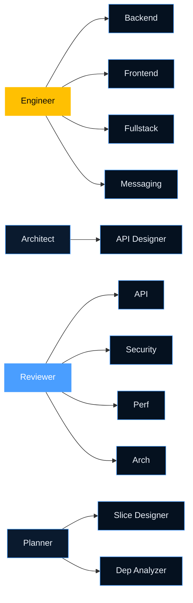
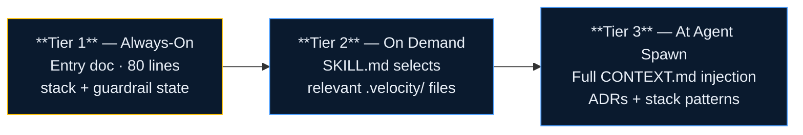

# Agents & Subagents

Velocity defines a fixed roster of 12 primary agent roles and 22 specialist subagents. Each agent has a scoped system prompt, wired skills, and clear responsibilities. They are configured by the Agent Factory based on your detected stack.



## Primary Agents

### Engineer

The primary workhorse. Implements features, runs the TDD loop, manages PRs, and executes the autonomous `/loop`.

**Key skills:** `/tdd`, `/validate`, `/handoff`, `/feedback-loop`, `/loop`  
**Activates subagents:** Backend Engineer, Frontend Engineer, Fullstack Engineer, Messaging Engineer

### Product

Owns requirements and feature planning.

**Key skills:** `/grill-me`, `/grill-with-docs`, `/to-prd`, `/to-features`, `/roadmap`  
**Activates subagents:** PRD Reviewer, Stakeholder Analyst

### Architect

Owns system design, architecture decisions, and domain model alignment.

**Key skills:** `/domain-model`, `/architecture-doc`, `/api-design`, `/adr-engine`, `/improve-codebase-architecture`  
**Activates subagents:** API Designer, Context Mapper

### Security

Owns threat modeling, auth/authz design, and vulnerability assessment.

**Key skills:** `/security-design`, `/risk-score`, `/audit-trail`  
**Activates subagents:** Threat Modeler, Auth Reviewer

### QA

Owns test strategy, coverage analysis, and regression planning.

**Key skills:** `/test-strategy`, `/validate`, `/feedback-loop`  
**Activates subagents:** API Tester, E2E Test Designer

### UX

Owns user flows, screen specifications, and design system alignment.

**Key skills:** `/design-intelligence`, `/grill-me` (UX variant)  
**Activates subagents:** Flow Designer, Accessibility Reviewer

### Planner

Decomposes features into tasks and builds the blocking dependency graph.

**Key skills:** `/to-tasks`, `/roadmap`, `/prototype`  
**Activates subagents:** Slice Designer, Dependency Analyzer

### Researcher

Analyzes external libraries, spikes, and produces recommendation reports.

**Key skills:** `/prototype`, external library analysis  
**Activates subagents:** Library Evaluator, Spike Writer

### Reviewer

Performs code review with a fresh context window (never the implementer).

**Key skills:** `/validate` (review variant), context-aware code critique  
**Activates subagents:** API Reviewer, Security Reviewer, Performance Reviewer

### Debugger

Systematic root cause analysis and incident investigation.

**Key skills:** Systematic debugging protocol, hypothesis testing  
**Activates subagents:** Log Analyst, Regression Tracer

### Documentation

Produces architecture documentation, API docs, runbooks, and ADRs.

**Key skills:** `/architecture-doc`, `/adr-engine`, `/ingest`  
**Activates subagents:** API Documenter, Runbook Writer

### Refactor

Deep module extraction, dependency inversion, and technical debt reduction.

**Key skills:** `/improve-codebase-architecture`, `/adr-engine` (refactor variant)  
**Activates subagents:** Module Extractor, Interface Designer

---

## Agent Context Protocol

Every agent loads context in three tiers before acting:



### Tier 1: Always-On (Every Message)

The entry document (`.cursor/rules/velocity.mdc`, `CLAUDE.md`, etc.) — maximum 80 lines in caveman syntax:

```
STACK: TypeScript/Next.js/PostgreSQL
CONTEXTS: orders, payments, notifications
CONTEXT.md: .velocity/context/
GUARDRAILS: active, hooks enabled
SKILLS: .cursor/skills/ or commands/
```

### Tier 2: Skill-Level Context (On Demand)

Loaded when a specific skill is invoked. The skill SKILL.md defines exactly which `.velocity/` files to read before acting.

### Tier 3: Agent System Prompt (At Agent Spawn)

Full context injection: relevant CONTEXT.md sections, project-context standards, recent ADRs, and stack-specific patterns.

---

## Subagents

Subagents are specialist roles activated under a primary agent for specific task types. They are generated by the Agent Factory based on your detected stack.

### Stack-Activated Subagents

| Subagent               | Activated When                                                  |
| ---------------------- | --------------------------------------------------------------- |
| **Backend Engineer**   | Backend framework detected (Spring Boot, Fastify, Django, etc.) |
| **Frontend Engineer**  | Frontend framework detected (React, Vue, Angular, etc.)         |
| **Fullstack Engineer** | Both frontend and backend detected                              |
| **Database Engineer**  | Complex persistence layer (multiple DBs, complex migrations)    |
| **Messaging Engineer** | Message broker detected (Kafka, RabbitMQ, SQS)                  |
| **API Designer**       | REST/GraphQL/gRPC APIs detected                                 |
| **DevOps Engineer**    | CI/CD + infrastructure configuration detected                   |

### Review Subagents

Activated under Reviewer with a fresh context window — they have never seen the implementation:

| Subagent                  | Focus                                              |
| ------------------------- | -------------------------------------------------- |
| **API Reviewer**          | Contract adherence, versioning, consistency        |
| **Security Reviewer**     | Auth checks, injection risks, secret exposure      |
| **Performance Reviewer**  | N+1 queries, unnecessary computation, memory       |
| **Architecture Reviewer** | Slice compliance, module boundaries, DDD alignment |

### Planning Subagents

| Subagent                | Focus                                            |
| ----------------------- | ------------------------------------------------ |
| **Slice Designer**      | Enforces vertical slice decomposition            |
| **Dependency Analyzer** | Builds blocking graph for task queue             |
| **Risk Assessor**       | Scores task risk using domain + surface analysis |

---

## Cognitive Roles

These agents are explicitly designed for tasks that require separation from the implementer:

**Reviewer** — Never reviews its own work. Always activated in a fresh window with only the diff and relevant context.

**Researcher** — Never writes production code. Produces reports and recommendations only.

**Debugger** — Approaches issues with a blank slate. Does not read implementation history; starts from symptoms and hypotheses.

---

## Customizing Agents

Agent definitions live in `.velocity/agents/` after `/init`. They are plain markdown and can be modified directly. After modifying, run `/sync` to regenerate the adapter-native assets.

```markdown
# .velocity/agents/engineer.md

## Role

Senior Software Engineer with deep knowledge of this project's stack and domain.

## Primary Skills

- /tdd
- /validate
- /handoff

## Wired Subagents

- backend-engineer (for API and data layer tasks)
- frontend-engineer (for UI tasks)

## Standards

Read .velocity/project-context/engineering.md before every task.
Follow CONTEXT.md for all identifier naming.
```
