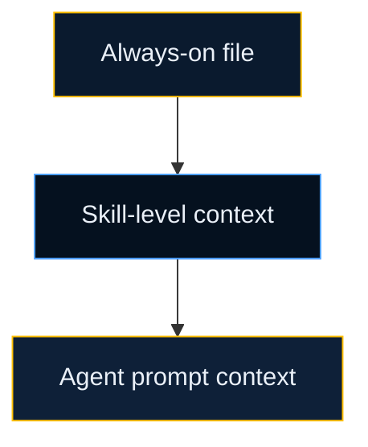

# Key Concepts

These are the terms you need to understand Velocity without reading every internal file.

## Skill

A skill is a reusable workflow stored in a `SKILL.md` file. You run it when you need a specific job done, such as planning, design, TDD, or validation.

Examples: `grill-with-docs`, `to-prd`, `to-tasks`, `tdd`, `validate`.

## Agent

An agent is a stable role with a clear job. Velocity keeps the roster fixed so teams know who does what.

| Agent | Primary responsibility |
| --- | --- |
| Engineer | implementation, TDD, PRs |
| Product | PRDs, feature boards, scope |
| Architect | system design, ADRs, technical decisions |
| Security | threat modeling, auth, secrets, compliance |
| QA | test strategy and validation |
| Planner | tasks, dependencies, sequencing |
| Researcher | codebase and context discovery |
| Reviewer | review with fresh context |

## Subagent

A subagent is a specialist used under a main agent for focused work.

Examples:

- backend engineer
- messaging engineer
- API reviewer
- slice designer

## Smart Router

The Smart Router is the entry point. It asks a few questions, detects the work type, and starts the right pipeline.

If the repo already has work in progress, the router can offer to resume it instead of starting over.

## Pipeline

A pipeline is the ordered set of phases for one kind of work.

| Work type | Pipeline |
| --- | --- |
| New feature | Discovery -> Design -> Planning -> Build -> Validate -> Review -> Release |
| Bug fix | Reproduce -> Root Cause -> Fix -> Validate -> Review -> Release |
| Extend feature | Context Load -> Impact Analysis -> Design Delta -> Build -> Validate -> Review -> Release |
| Refactor | Analysis -> Proposal -> Validate Proposal -> Refactor -> Validate -> Review -> Release |

## Phase State

Phase state is the saved record of where a work item is in its pipeline. It lives in `.velocity/sdlc/state/`.

This is what makes sessions resumable.

## Adapter

An adapter translates the same `.velocity/` source into the native format for each assistant.

| Adapter | Generates |
| --- | --- |
| `cursor-adapter` | `.cursor/rules/`, agents, skills, hooks |
| `claude-code-adapter` | `CLAUDE.md`, subagents, commands, hooks |
| `copilot-adapter` | `.github/copilot-instructions.md`, `AGENTS.md`, prompt files |
| `gemini-adapter` | `GEMINI.md`, Gemini agents, tool definitions |

## CONTEXT.md

`CONTEXT.md` is the shared language file for the domain. It keeps code, docs, and AI output on the same terms.

Example:

| Term | Meaning | Do not use |
| --- | --- | --- |
| `PaymentIntent` | A request to collect money | `Transaction`, `PaymentOrder` |
| `RefundWindow` | Time range when a refund can start | `RefundPeriod`, `ReturnWindow` |

## Agent Context Protocol

Velocity loads context in layers so sessions stay focused.



- Always-on: small entry file loaded every session
- Skill-level: only the workflow-specific context needed right now
- Agent prompt: role-specific rules and standards

## Guardrails

Guardrails are checks that stop risky or low-quality output before it runs.

Examples:

- git safety
- SQL safety
- secret detection
- high-risk pause gates

## Vertical Slice

A vertical slice is the smallest end-to-end piece of useful work. It crosses the layers it needs and gives feedback early.

Example: "Create refund request" is a slice. "Build all refund database tables" is not.

## RALPH Loop

RALPH Loop is the project-level feedback loop.

After a phase completes, the team can rate the output. After enough ratings, Velocity suggests improvements to local skills and agent configs.

## Greenfield vs Brownfield

Velocity classifies your repo at `/init` time and runs a different flow based on the result.

| | Greenfield | Brownfield |
|---|---|---|
| **Signals** | Little/no source code, no docs, shallow git history | Meaningful source, existing docs, ADRs, or substantial history |
| **CONTEXT.md** | Empty scaffold — you build the glossary via `/grill-me` | DRAFT terms seeded from code signals by `context-harvest` |
| **Knowledge base** | Placeholder only | Ingested from ADRs, git history, docs, incidents |

Brownfield DRAFT terms are never asserted as confirmed — every seeded term carries a `DRAFT` marker and must be promoted via `/grill-with-docs`.

## Knowledge Graph

The `knowledge-graph` skill derives structural relationships directly from the codebase using built-in search — no external packages needed.

It has four modes:

| Mode | When to use |
|------|-------------|
| `impact` | Before any rename, signature change, or deletion — shows blast radius |
| `context` | Before touching an unfamiliar symbol — 360° view of callers, callees, role |
| `trace` | When debugging — full call chain from an entry point across layers |
| `cluster-map` | On demand — groups files by import coupling → maps to bounded contexts |

Cluster-map output feeds into `/ingest` (for the knowledge base) and `context-harvest` (for richer DRAFT term seeding).

## Rule Pack

A rule pack is a bundle of standards imported into the project.

Typical sources:

- team standards
- domain standards
- compliance requirements
- community rule collections

## `.velocity/` Directory

The `.velocity/` directory is the project's source of truth for context, workflows, and generated artifacts.

```text
.velocity/
├── project-intelligence/   ← stack fingerprint, repo maturity
├── project-context/         ← engineering, testing, security, API standards
├── agents/                  ← configured agent instances
├── skills/                  ← stack-specific skill variants
├── guardrails/              ← rules and hooks
├── knowledge-base/          ← ADRs, incidents, runbooks, git digest, graph clusters
├── sdlc/                    ← pipeline.yaml, pipeline-config.yaml, state/
└── artifacts/               ← prds, features, tasks, handoffs, impact reports, …
```

If you remember only one thing: Velocity works by routing the request first, loading the right context second, and executing inside a controlled phase flow after that.