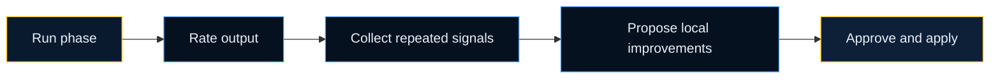

# RALPH Loop

RALPH Loop is the feedback loop for teams using Velocity in their own repositories.

It helps the project get better at using Velocity over time.

## What It Means

RALPH stands for:

- Run
- Annotate
- Learn
- Propose
- Harden

## How It Works

## What Gets Improved

RALPH Loop improves the local project setup, for example:

- project-specific skill wording
- agent guidance for the repo
- local review rules
- phase-level prompts that keep missing the same detail

## What It Does Not Do

- it does not change the upstream Velocity platform automatically
- it does not send project data out of the repo
- it does not apply changes without approval

## Real-World Examples

| Pattern seen in reviews | Likely improvement |
| --- | --- |
| Design phase keeps missing API migration notes | tighten design prompt for API-breaking changes |
| TDD runs often forget contract tests | update local engineering guidance for that stack |
| Review output is too long for the team | simplify review gate wording in local config |

## When To Enable It

Enable RALPH Loop when the team expects to use Velocity repeatedly on the same repo and wants local improvements based on review feedback.

If the repo is experimental or short-lived, you may not need it.