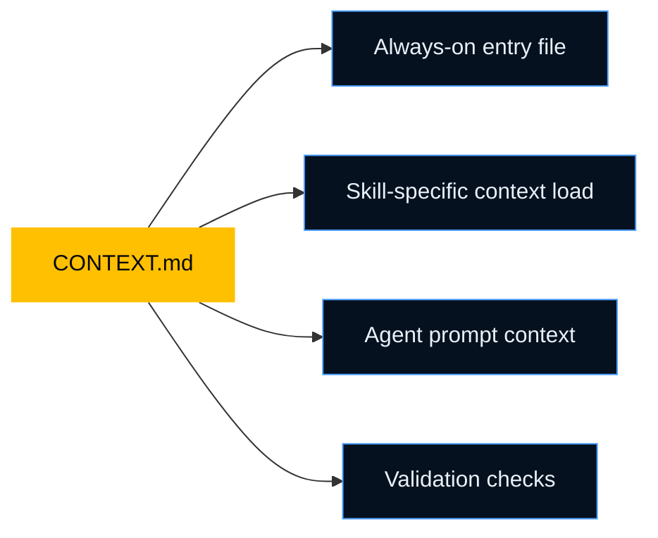

# CONTEXT.md — Ubiquitous Language

`CONTEXT.md` is the shared language file for your project. It defines what key terms mean and which words the team should not use as substitutes.

## Why Ubiquitous Language Matters

Many software bugs start as naming drift.

If product says `Policy`, the API says `Contract`, and the database says `Agreement`, the assistant has to guess what is actually the same thing.

Velocity removes that guesswork by keeping one vocabulary for:

- domain experts
- developers
- AI assistants
- documentation

## A Good CONTEXT.md Entry

Each term should answer four questions:

1. What does it mean?
2. What is the code form?
3. Which similar words should not be used?
4. Which context owns it?

```markdown
### RefundRequest

A request to return captured funds to a customer.

- Code: `RefundRequest`, `refund_request_id`
- Not: `RefundOrder`, `ReturnRequest`
- Context: payments
```

## Real-World Example

| Team language | Good | Avoid |
| --- | --- | --- |
| Insurance platform | `Policy`, `Policyholder`, `RenewalWindow` | `Plan`, `User`, `ExtensionPeriod` |
| Healthcare platform | `Encounter`, `Provider`, `Claim` | `Visit`, `Doctor`, `Ticket` |
| Commerce platform | `Cart`, `CheckoutSession`, `PaymentIntent` | `Basket`, `Purchase`, `Transaction` |

## How It Gets Used



- Entry files keep the most important terms visible
- Skills load the terms they need for the current task
- Agents use those terms in generated code and docs
- Validation checks catch naming drift before merge

## How To Create It

### New project

Run `grill-me` to define the vocabulary before implementation grows.

### Existing project

Run `grill-with-docs` so Velocity reads current code and documentation first, then tightens the language with you.

## Multi-Context Projects

Large systems often need more than one `CONTEXT.md`.

```text
.velocity/context/
├── CONTEXT.md
├── payments/CONTEXT.md
├── claims/CONTEXT.md
└── identity/CONTEXT.md
```

Use a shared top-level file only for cross-context terms.

## How It Stays Current

- `context-engine` checks whether code is drifting from the defined terms
- `context-merge` helps reconcile competing proposals from parallel sessions
- `validate` can flag terminology drift before review

## Practical Rule

If a term matters enough to appear in code, docs, tests, or business discussion, define it once and keep it stable.