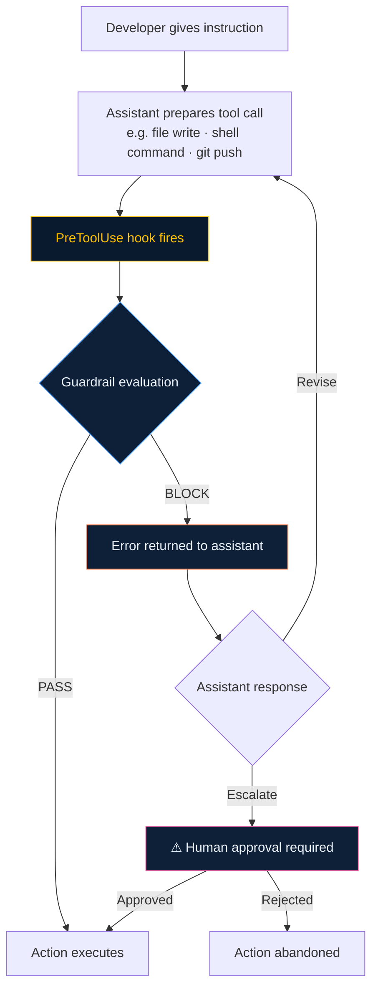

# Guardrails & Hooks

Velocity's guardrail system provides automated enforcement of coding standards, safety rules, and security policies. Guardrails run on every AI tool call via `PreToolUse` hooks — catching dangerous actions before they execute.

## How Guardrails Work



The hook intercepts the action _before_ it executes. Blocked actions are never run.

## Guardrail Factory

The `/guardrail-factory` skill generates your guardrail configuration from your detected stack. It only activates guardrails relevant to your project:

- Kafka guardrails → only if Kafka is detected
- SQL safety → only if a database is detected
- Secret scanning → always active
- Git safety → configurable enforcement level

**Output files:**

- `.velocity/guardrails/default.md` — Guardrail definitions
- `hooks.json` — Hook configuration for your assistant

## Built-in Guardrail Coverage

### Git Safety

Prevents destructive git operations:

| Rule                      | Action                                        |
| ------------------------- | --------------------------------------------- |
| `no_force_push_main`      | Block `git push --force` to main/master       |
| `branch_naming`           | Require `feature/`, `fix/`, `chore/` prefixes |
| `no_direct_main_commit`   | Block commits directly to main/master         |
| `no_branch_deletion_prod` | Block deletion of release/production branches |

### SQL Safety

Guards against destructive database operations:

| Rule                      | Action                                                    |
| ------------------------- | --------------------------------------------------------- |
| `require_where_on_delete` | Block `DELETE FROM` without `WHERE` clause                |
| `require_where_on_update` | Block `UPDATE` without `WHERE` clause                     |
| `no_ddl_in_migrations`    | Block `DROP TABLE` / `DROP COLUMN` without review flag    |
| `no_prod_direct_query`    | Flag direct queries against production connection strings |

### Secret Detection

Prevents credential exposure:

| Rule                     | Action                                          |
| ------------------------ | ----------------------------------------------- |
| `no_api_keys_in_code`    | Block writing files containing API key patterns |
| `no_passwords_in_config` | Block hardcoded passwords in config files       |
| `no_private_keys`        | Block writing private key material              |
| `env_vars_only`          | Flag inline secrets; suggest env variable       |

### Kafka Topic Guard (if Kafka detected)

Protects streaming infrastructure:

| Rule                     | Action                                         |
| ------------------------ | ---------------------------------------------- |
| `consumer_group_naming`  | Require `[service]-[context]-consumer` pattern |
| `no_topic_deletion`      | Block topic deletion without explicit approval |
| `partition_count_review` | Pause for review if partition count changes    |

### High-Risk Pause Gate

Stops execution for human approval:

| Trigger                       | Condition                                 |
| ----------------------------- | ----------------------------------------- |
| Risk score > 70               | Risk assessment produces high score       |
| Production data               | Query/mutation targets production dataset |
| Cross-service contract change | API contract modification detected        |
| Infrastructure change         | Kubernetes/Terraform/Helm changes         |
| Schema migration              | Database schema modification              |

## Configuration

Guardrails are configured in `.velocity/guardrails/default.md`:

```yaml
guardrails:
  version: "2.0"

  git_safety:
    enabled: true
    enforcement: strict # strict | warn | off
    main_branches: [main, master, release/*]

  sql_safety:
    enabled: true
    require_where: [DELETE, UPDATE]
    ddl_requires_review: true

  secret_detection:
    enabled: true
    patterns: [API_KEY, SECRET, PASSWORD, PRIVATE_KEY, TOKEN]

  kafka:
    enabled: true # auto-set by project intelligence
    consumer_group_pattern: "{service}-{context}-consumer"
    protect_topics: [payment-events, order-events]

  high_risk_pause:
    enabled: true
    threshold: 70 # 0-100 risk score
    approval_required: [infrastructure, schema_migration, contract_change]
```

## Adapter Integration

Each adapter generates the hooks in its native format:

<details open>
<summary><strong>Cursor (hooks.json)</strong></summary>

```json
{
  "hooks": [
    {
      "event": "PreToolUse",
      "match": "Bash",
      "run": "scripts/guardrail-check.sh"
    },
    {
      "event": "PreToolUse",
      "match": "Write",
      "run": "scripts/secret-scan.sh"
    }
  ]
}
```

</details>

<details>
<summary><strong>Claude Code (hooks/)</strong></summary>

```bash
# hooks/pre-tool-use/git-safety.sh
#!/bin/bash
# Generated by Velocity guardrail-factory
if echo "$TOOL_INPUT" | grep -q "git push --force"; then
  echo "BLOCK: Force push to main is not allowed."
  exit 1
fi
```

</details>

## Extending Guardrails

### Adding a Custom Rule

1. Edit `.velocity/guardrails/default.md` to define the rule
2. Run `/sync` to regenerate the hook scripts
3. Commit the updated hooks

### Importing Team Standards via Rule Packs

```
/rule-pack-engine
```

The `/rule-pack-engine` skill imports external rule collections and classifies them automatically:

- Rules classified as `guardrail` → merged into `guardrails/packs.md`
- Rules classified as `always-on` → compressed into the entry document
- Rules classified as `skill` → added as new skills
