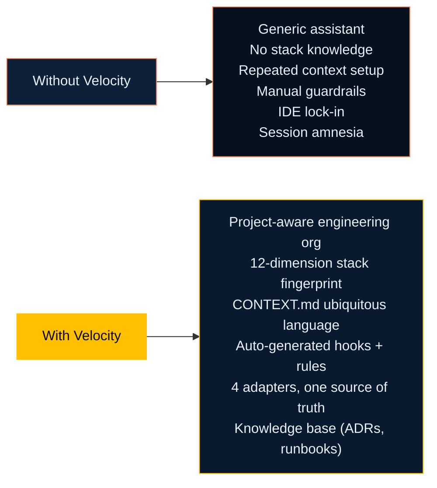
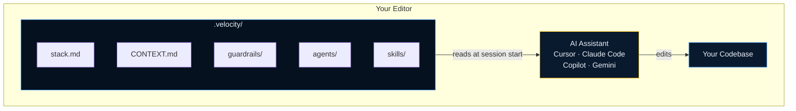

# What is Velocity?

Velocity is the operating layer around your AI assistant. It does not replace Copilot, Cursor, Claude Code, or Gemini. It gives them the same project context, the same workflow entry points, and the same review rules.

## The Problem It Solves

Without shared context, every AI session starts too wide and too shallow.

- The assistant guesses your stack and naming
- The team repeats the same setup instructions
- Bug fixes jump to code before the cause is clear
- Design decisions get lost between sessions
- Different assistants behave differently on the same repo

Teams usually patch this with long prompts, ad hoc rules, and manual review habits. That does not scale.

## The Solution

Velocity makes the repository self-describing and workflow-driven.

You start with routing, not with implementation.

## What Changes In Practice

| Before Velocity | With Velocity |
| --- | --- |
| The user explains the task from scratch | The router classifies the task and loads the right workflow |
| The assistant guesses stack and patterns | Project intelligence and CONTEXT.md are loaded first |
| Progress is lost between sessions | Phase state and handoff artifacts make work resumable |
| Teams depend on one assistant's quirks | Adapters keep multiple assistants aligned |
| Review is manual and inconsistent | Review gates, guardrails, and validation are part of the flow |

## Design Principles

### 1. Assistant-agnostic

Velocity keeps one source of truth and generates assistant-specific files from it. The repo does not need different standards for different tools.

### 2. Purely prompt-driven

No daemon. No server. No hidden runtime. The behavior lives in files the team can read, review, and version.

### 3. Classification-first

Every request is classified before work begins. That classification decides which context, phases, and checks load.

### 4. Brownfield-ready

Velocity is built for existing repos. It reads what exists first and avoids inventing patterns or names that the codebase does not use.

### 5. Vertical slices only

Work is broken into end-to-end slices. That keeps feedback fast and reduces half-finished horizontal work.

### 6. Progressive disclosure

The assistant gets only the context it needs for the current request. That keeps sessions focused and avoids context bloat.

### 7. Token economy

Every piece of context has a cost. Velocity enforces explicit token budgets — always-on context is capped, skill payloads are scoped, and caveats are declared so the model stays focused and output remains deterministic.

## The Main Building Blocks

| Building block | Purpose |
| --- | --- |
| Smart Router | Detects the work type and starts the right pipeline |
| Project Intelligence | Detects stack, architecture signals, test tools, and repo shape |
| CONTEXT.md | Defines the domain language used by code, docs, and agents |
| Skills | Reusable workflows such as `to-prd`, `to-tasks`, `tdd`, and `validate` |
| Agents | Stable roles such as planner, architect, engineer, QA, and reviewer |
| Guardrails | Checks that stop unsafe or low-quality output |
| Adapters | Generate native files for each assistant |

## Real-World Examples

| Work | What Velocity changes |
| --- | --- |
| New customer onboarding flow | Adds discovery, design, planning, and validation instead of skipping straight to UI code |
| Production refund bug | Forces reproduction and root cause before implementation |
| API extension for a partner | Loads the existing feature context first and asks for only the design delta |
| Monolith cleanup | Requires a proposal and validation path before code movement starts |

## What Velocity Is Not

- Not a replacement for your coding assistant
- Not a hosted service
- Not a magic code generator
- Not tied to one IDE or vendor

## Where To Go Next

- [Smart Router](/guide/smart-router)
- [SDLC Pipeline](/guide/sdlc-pipeline)
- [Key Concepts](/guide/concepts)
- [Quickstart](/guide/quickstart)# What is Velocity?

Velocity is **The Acceleration Layer for AI Coding Assistants**. It does not replace Cursor, Claude Code, GitHub Copilot, or Gemini — it sits alongside them as an intelligence layer that makes any assistant project-aware.

## The Problem

AI coding assistants are powerful but generic. When you open a new chat:

- The assistant knows nothing about your stack, architecture, or domain
- It ignores your team's coding standards and conventions
- It has no awareness of your compliance requirements
- It cannot accumulate knowledge between sessions
- It writes code that looks right but violates your patterns

Teams write long system prompts, keep hand-rolled rule files, and re-explain context on every task. When the assistant changes, everything has to be rewritten.

## The Solution

Velocity transforms your repository into a self-describing project that any AI assistant can read and understand immediately.

## Design Principles

### 1. Assistant-Agnostic

Velocity maintains a single canonical configuration in `.velocity/` and generates native assets for each assistant via adapters. One change propagates everywhere via `/sync`.

### 2. Purely Prompt-Driven

No daemon. No CLI. No server. Every Velocity capability is a generated file — a `SKILL.md`, a rule, a hook, an agent prompt — that the AI assistant executes. The only runtime is the AI itself.

### 3. Product-First

Velocity's canonical skill chain starts with discovery (`/grill-me`, `/grill-with-docs`), moves through planning (`/to-prd`, `/to-features`, `/to-tasks`), and ends at code (`/tdd`). Engineering follows product intent.

### 4. Brownfield-Ready

Velocity is designed for existing codebases. The `/grill-with-docs` skill reads your existing code and documentation to extract domain language before suggesting any changes. It never invents terms.

### 5. Vertical Slices Only

Skills enforce end-to-end feature delivery over horizontal layers. No half-done backends, no frontends without APIs. Every task is a tracer bullet through the full stack.

### 6. Progressive Disclosure

Context is injected in three tiers:

1. **Always-on** — 80 lines max, loaded on every message (caveman syntax)
2. **Skill-level** — loaded when a skill is invoked
3. **Agent system prompt** — full standards + CONTEXT.md, injected at agent spawn

### 7. Token Economy

Context has a cost. Velocity enforces explicit token budgets at every tier — always-on payloads are capped, skill context is scoped to the active phase, and caveats are declared upfront. The model never receives more than it needs, keeping output deterministic and sessions resumable without compaction loss.

## Runtime Model

The assistant reads `.velocity/` at the start of every session. It knows your stack, your domain, your standards. It acts like a senior engineer who has already read the codebase.

## What Velocity Is Not

- **Not a code generator** — Velocity structures how the assistant works, not what it produces
- **Not plugin-only** — Plugins only place prompt files; Velocity remains pure file-based configuration with no runtime
- **Not opinionated about your stack** — Works with any language, framework, or architecture
- **Not a walled garden** — Open format; every generated file is readable markdown or JSON

---

## SDLC Pipeline

The SDLC pipeline sits on top of Velocity's context and skill layer. It gives every piece of work a clear path — from the first question through release — with defined phases, human checkpoints, and state that persists across sessions.

### Smart Router

Run `/velocity` in Cursor or Claude Code, or use `#velocity` in Copilot. The router asks three questions, checks your recent git history and open issues, and picks the right pipeline for your work. If it finds an in-progress pipeline on your feature branch, it offers to resume that first.

### Pipeline Variants

| Work Type | Phases |
| --------- | ------ |
| **New Feature** | Discovery → Design → Planning → Build → Validate → Review → Release |
| **Bug Fix** | Reproduce → Root Cause → Fix → Validate → Review → Release |
| **Extend Existing Feature** | Context Load → Impact Analysis → Design Delta → Build → Validate → Review → Release |
| **Refactor** | Analysis → Proposal → Validate Proposal → Refactor → Validate → Review → Release |

### Phase State

State is saved to `.velocity/sdlc/state/<work-id>.yaml` on your feature branch — versioned alongside your code.

| Feature | How it works |
| ------- | ------------ |
| **Session resume** | Open a new session and Velocity picks up where you left off |
| **Audit trail** | Every phase transition is timestamped and attributed |
| **Parallel features** | Each feature has its own state file; they don't interfere |
| **Phase rollback** | Roll back to an earlier phase when a later problem traces upstream |

A phase only advances when its exit criteria pass. At human review gates, you see a summary of what was produced, what decisions were made, what you're being asked to approve, and what comes next.

### Per-Phase Interview

Before each phase runs, you get up to five questions — generated fresh from your current `CONTEXT.md`, open ADRs, and existing artifacts. Each question has a suggested answer so you can move quickly when the default is right.

### RALPH Loop

An optional feedback loop you activate during `/velocity-init`. After each phase, rate the output at the review gate. Once you've rated the same skill or phase five or more times, Velocity spots the patterns and suggests improvements to your local skill files and agent configs.

### Who owns what

| Responsibility | Owner |
| -------------- | ----- |
| Phase definitions and order | Velocity (`pipeline.yaml`) |
| Phase state and transitions | Velocity (Phase Engine) |
| Review gate format | Velocity |
| Artifact storage | Velocity (`.velocity/artifacts/`) |
| Guardrail checks at gates | Velocity |
| RALPH feedback and proposals | Velocity (RALPH Loop) |
| Code generation, test running, tool calls | Your AI assistant |
| Generating phase interview questions | Your AI assistant (reads current context each time) |
