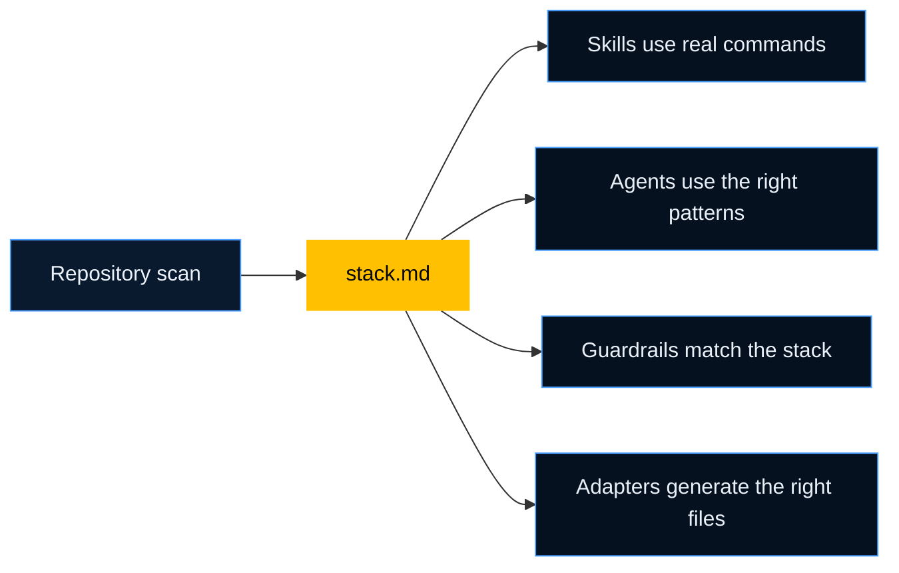

# Project Intelligence

Project Intelligence is the repo scan that tells Velocity what kind of system it is working in. It writes that result to `stack.md`, and every agent uses it before acting.

## Overview

When you run `/init` or `/project-intelligence`, Velocity inspects the repo and records the things an assistant would otherwise guess.

That includes:

- languages
- frameworks
- test tools
- data stores
- messaging
- repo structure
- bounded contexts
- CI and deployment signals



## Why It Matters

Without Project Intelligence, an assistant might do any of these:

- run the wrong test command
- suggest React patterns in a Vue repo
- miss that the repo uses Kafka or gRPC
- ignore that the system is a monorepo

With Project Intelligence, the assistant starts closer to how a teammate would start after scanning the repo.

## What It Detects

| Area | Typical output |
| --- | --- |
| Languages | TypeScript, Python, Java, Go, SQL |
| Frontend | Next.js, React, Vue, Tailwind, Vite |
| Backend | Fastify, Spring Boot, Express, NestJS |
| Persistence | PostgreSQL, Prisma, Redis, MongoDB |
| Messaging | Kafka, RabbitMQ, SQS |
| API style | REST, GraphQL, gRPC |
| Testing | Vitest, Jest, Playwright, Cypress |
| Repo layout | monorepo vs single service |
| Bounded contexts | payments, claims, identity, notifications |
| CI/CD | GitHub Actions, Docker, Helm, Kubernetes |

## Real-World Examples

| Situation | What Project Intelligence prevents |
| --- | --- |
| A Next.js app with Playwright | Stops the assistant from defaulting to CRA or Jest-only guidance |
| A Spring Boot service with Kafka | Loads backend and messaging expectations before design or fixes |
| A pnpm monorepo | Helps the assistant scope work to the right package instead of the whole repo |
| A healthcare platform with multiple bounded contexts | Keeps terms and behavior scoped to the right domain area |

## Example Output

```yaml
project:
  type: monorepo

frontend:
  framework: Next.js

backend:
  framework: Fastify

testing:
  unit: Vitest
  e2e: Playwright

messaging:
  broker: Kafka

architecture:
  contexts: [payments, claims, identity]
```

## How Agents Use It

- `tdd` uses the right test runner
- adapters generate the right file types
- guardrails activate only where they matter
- agent factory wires the right subagents

## Delta Mode

`/sync` does not need to rescan everything every time. It can look at changes and update only the affected outputs.

That keeps regeneration fast and avoids noise in unchanged areas.

## When To Run It

- during `/init`
- after large repo changes
- after adding a major framework or service boundary
- when the assistant starts behaving like it is using stale repo knowledge

If you want one summary sentence: Project Intelligence reduces assistant guesswork at the source.