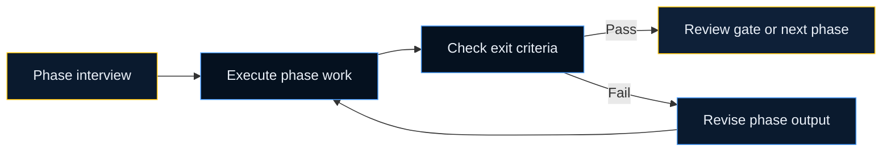

# SDLC Pipeline

The SDLC pipeline gives each work item a clear path from start to release. It is the layer that turns AI help into governed delivery instead of isolated code generation.

## Pipeline Variants

| Work type | Phases |
| --- | --- |
| New feature | Discovery -> Design -> Planning -> Build -> Validate -> Review -> Release |
| Bug fix | Reproduce -> Root Cause -> Fix -> Validate -> Review -> Release |
| Extend existing feature | Context Load -> Impact Analysis -> Design Delta -> Build -> Validate -> Review -> Release |
| Refactor | Analysis -> Proposal -> Validate Proposal -> Refactor -> Validate -> Review -> Release |

## How A Phase Works

Every phase uses the same operating pattern:

1. ask focused questions
2. produce one clear output
3. check exit criteria
4. move forward only when the phase is ready

## Phase State

State is saved in `.velocity/sdlc/state/<work-id>.yaml`.

This gives you:

- session resume
- audit trail
- parallel work items on the same repo
- targeted rollback when a later phase finds an earlier mistake

## Human Review Gates

Review gates are where the user approves what was produced before the work advances.

Typical review gates happen after:

- discovery or context capture
- design
- planning
- validation
- final review

## Hybrid Ownership

| Velocity owns | Your AI assistant owns |
| --- | --- |
| phase order | code generation |
| state and transitions | tool calls |
| gate format | implementation detail inside the phase |
| artifact storage | local execution choices |
| audit trail | writing tests and fixing code |

## Real-World Examples

| Work item | Why the pipeline helps |
| --- | --- |
| A checkout feature | Forces discovery, design, planning, and validation instead of skipping straight to UI code |
| A payment regression | Forces repro and diagnosis before a fix lands |
| A feature extension in a mature service | Loads existing context before proposing a delta |
| A risky cleanup | Requires a proposal and validation path before refactoring starts |

## Rollback

Rollback is phase-based, not all-or-nothing.

Example:

1. build finds that the design assumption was wrong
2. the pipeline rolls back to design
3. design is corrected
4. build resumes after the updated approval

That keeps unaffected work intact.

## Related Pages

- [Smart Router](/guide/smart-router)
- [RALPH Loop](/guide/consumer-ralph)
- [Canonical Skill Chain](/guide/skill-chain)