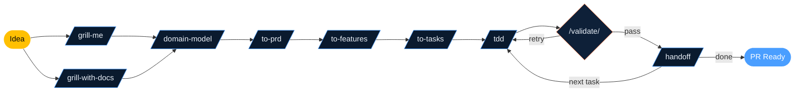
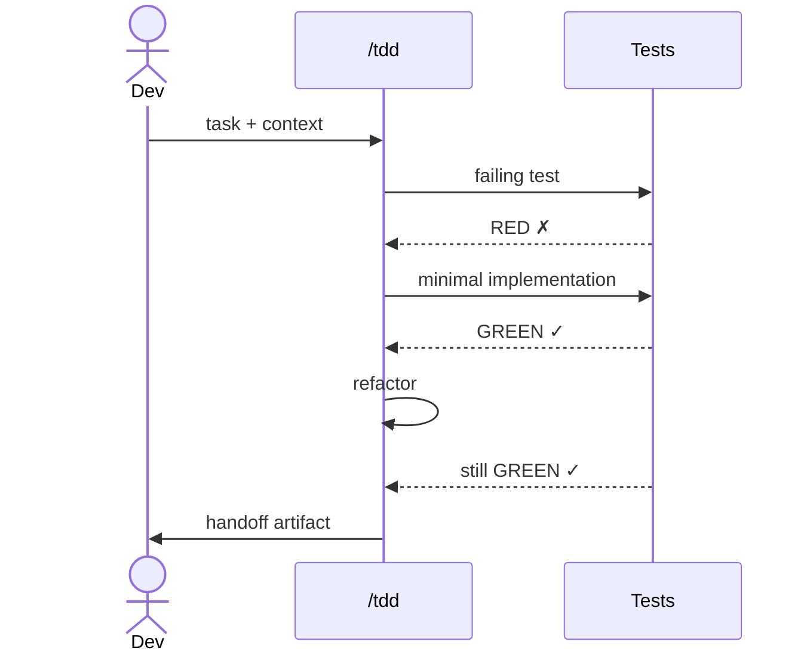
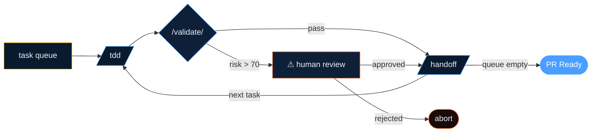

# Canonical Skill Chain

The canonical skill chain is Velocity's recommended end-to-end workflow — from product idea to shipped, tested code. Each step produces a structured artifact that feeds the next.

## The Full Chain

Or, run the entire chain autonomously with `/loop`.

## Each Step in Detail

### `/grill-me` — Greenfield Discovery

**Use when:** Starting a new project or feature from scratch.

Asks one sharp question at a time with a recommended answer. Covers product fundamentals, domain boundaries, architecture decisions, scale requirements, security constraints, and vertical slice framing.

**Output:** Decision summary, CONTEXT.md-format term list, open questions.

### `/grill-with-docs` — Brownfield Discovery

**Use when:** Adding a feature to an existing codebase.

Reads existing code and documentation first, extracts domain language, then interviews you to fill gaps. Never invents terms — discovers what already exists.

**Output:** Context proposals for CONTEXT.md, gap analysis, domain questions answered.

### `/domain-model` — CONTEXT.md Alignment

**Use when:** Before writing a PRD for a new feature.

Reads CONTEXT.md and existing ADRs. Flags misalignments between the planned feature and established domain language. Proposes CONTEXT.md updates if new terms are needed.

**Output:** Domain alignment report, proposed CONTEXT.md changes.

### `/to-prd` — Product Requirement Document

**Input:** Feature brief (1-2 sentences is enough)

Produces a structured PRD with:

- Problem statement
- Success criteria
- User stories (in CONTEXT.md language)
- Acceptance criteria
- Edge cases
- Out-of-scope items
- Vertical slice breakdown

**Output:** `.velocity/artifacts/prd/[feature-name].md`

### `/to-features` — Vertical Slice Board

**Input:** PRD from `/to-prd`

Breaks the PRD into vertical slices — end-to-end feature increments, not horizontal layers. Each slice has a clear user-visible outcome and a defined tracer bullet through the stack.

**Output:** `.velocity/artifacts/features/[feature-name].md` with slice board.

### `/to-tasks` — Task Decomposition

**Input:** Feature board from `/to-features`

Breaks each feature slice into tasks with:

- Estimated complexity (S/M/L/XL)
- Blocking relationships
- Risk score (0–100)
- Required skills and subagents

**Output:** `.velocity/artifacts/tasks/[feature-name].md` with task queue.

### `/tdd` — Test-Driven Development

**Use:** One task per session, always in a fresh context window.

Follows strict TDD:

1. Read task description + stack.md + CONTEXT.md
2. Write failing test(s) that describe the expected behavior
3. Write minimal implementation to pass the tests
4. Refactor with tests green
5. Run feedback gates (typecheck, lint, test)
6. Produce handoff artifact

**Output:** Implemented task + passing tests + handoff artifact.

### `/validate` — Pre-PR Quality Gate

**Use:** Before every pull request.

Runs 12 checks:

1. Vertical slice compliance (no horizontal layer work)
2. CONTEXT.md alignment (code uses defined terms)
3. Test coverage above threshold
4. No secrets or credentials in diff
5. Guardrail rules not violated
6. ADRs up to date for architectural decisions
7. Risk score within acceptable range
8. API contract not broken
9. Database migration safety
10. Dependency vulnerability scan
11. Performance regression check
12. Documentation updated

**Output:** Validation report; blocks PR if critical checks fail.

### `/handoff` — Context Reset Artifact

**Use:** After completing a task or vertical slice.

Produces a compact handoff document that captures:

- What was built
- Decisions made (with rationale)
- Open questions for the next session
- Test coverage achieved
- Files changed

**Output:** `.velocity/artifacts/handoffs/[slice-id].md`

## Shortcut: `/loop`

The `/loop` skill executes the full chain autonomously:

High-risk actions automatically pause for human review. The loop state is written to disk so it can resume after session interruption.
