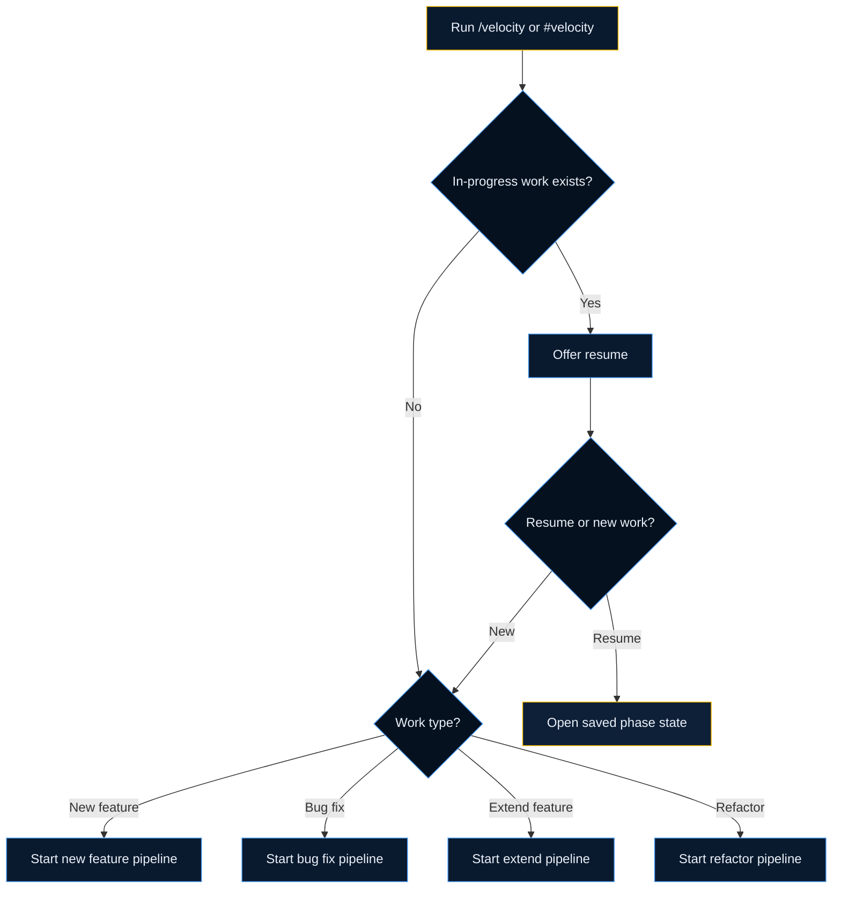

# Smart Router

The Smart Router is the default entry point for work. It helps the assistant start with the right workflow instead of jumping straight into implementation.

## What It Does

When you run `#velocity` or `/velocity`, the router:

1. checks for in-progress work
2. asks a few high-impact questions
3. classifies the request
4. starts the matching pipeline

## The Routing Questions

The exact wording can change, but the router usually needs answers to these decisions:

| Question | Why it matters |
| --- | --- |
| What are you working on? | Distinguishes feature, bug fix, extension, or refactor |
| Do you already have context or artifacts? | Decides whether discovery is needed |
| Is there work already in progress? | Prevents duplicate pipelines and lost state |

## Decision Flow

## Real-World Examples

| Situation | Router decision |
| --- | --- |
| "Add policy renewal reminders" | New feature |
| "Refund API started timing out after the last deploy" | Bug fix |
| "Add one more field to the existing claims endpoint" | Extend existing feature |
| "This module is hard to change and needs cleanup" | Refactor |

## What The Router Loads

After classification, the router can load:

- the pipeline definition
- current project context
- prior work state
- relevant artifacts such as ADRs or existing feature docs

## Resume Behavior

If the repo already has a saved pipeline state, the router can offer to continue it.

That matters in real teams because work often spans more than one AI session.

## When To Override The Default

Start with the router unless you already know you need a specific skill for a narrow task.

Good reasons to skip straight to a specific skill:

- you are only running `validate`
- you are only refreshing adapters with `sync`
- you are only using a specialized workflow such as `rule-pack-engine`

For most engineering work, the router is the correct start.