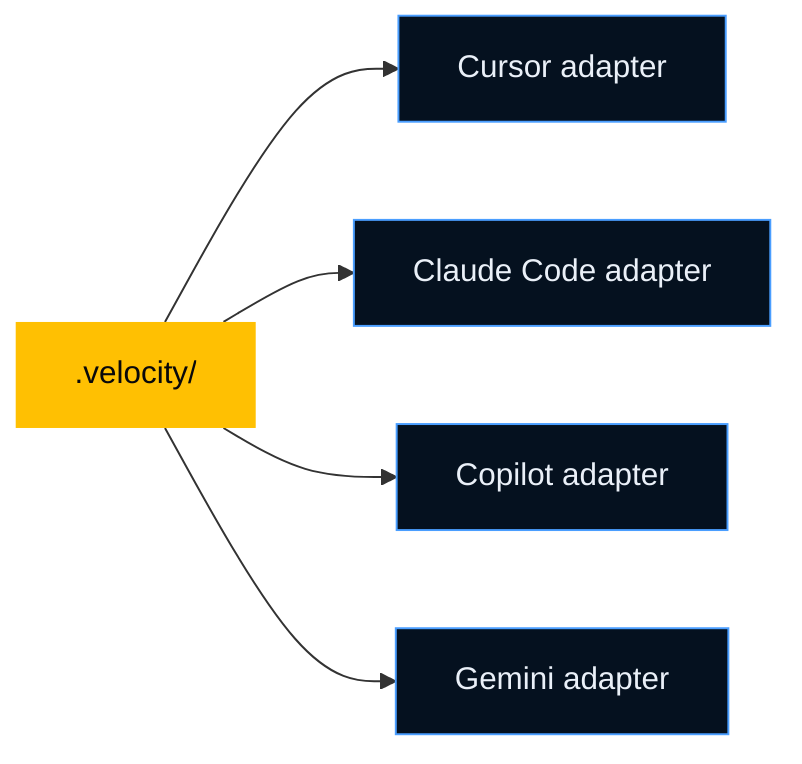

# Adapters Overview

Adapters let one Velocity setup work across multiple assistants. You keep one source of truth in `.velocity/`, and adapters generate the files each assistant expects.

## Why This Matters

Real teams do not always use one assistant.

- a platform engineer may use Cursor
- an app team may use Copilot in VS Code
- a reviewer may prefer Claude Code

Adapters keep those teams aligned without rewriting the project layer for each tool.

## How Adapters Work



The point is consistency. Different developers can use different assistants without rewriting project context for each tool.

## Supported Assistants

| Assistant | Adapter | Always-on format |
| --- | --- | --- |
| [Cursor](/adapters/cursor) | `cursor-adapter` | `.cursor/rules/velocity.mdc` |
| [Claude Code](/adapters/claude-code) | `claude-code-adapter` | `CLAUDE.md` |
| [GitHub Copilot](/adapters/copilot) | `copilot-adapter` | `.github/copilot-instructions.md` |
| [Gemini](/adapters/gemini) | `gemini-adapter` | `GEMINI.md` |

## What Changes Between Assistants

| Capability | Cursor | Claude Code | Copilot | Gemini |
| --- | --- | --- | --- | --- |
| Entry file | `.cursor/rules/*.mdc` | `CLAUDE.md` | `.github/copilot-instructions.md` | `GEMINI.md` |
| Agent files | separate agent files | subagents | combined agent file | separate agent files |
| Skill invocation | slash commands | slash commands | prompt files or chat prompts | tool-style commands |
| Hooks | native hooks | shell hooks | usually lighter/manual | depends on host support |

## Real-World Examples

| Team setup | Why adapters help |
| --- | --- |
| Platform team uses Cursor, app team uses Copilot | Both teams still read the same context and guardrails |
| One repo has mixed IDE preferences | The repo stays aligned without maintaining two doc systems |
| A team migrates from one assistant to another | Velocity keeps the project layer stable during the move |

## Running One Adapter

Adapters usually run during `/init` and `/sync`. Run one directly only when you want to refresh one assistant's files.

```text
/cursor-adapter
/claude-code-adapter
/copilot-adapter
/gemini-adapter
```

## Delta Mode

During `/sync`, adapters update only the outputs whose inputs changed.

Files with meaningful manual customization can be flagged instead of being overwritten blindly.

## Which Adapter Should You Use?

Use the adapter for the assistant your team is actually using. If the team uses more than one, keep them all generated.

The main rule is simple: maintain one project definition, not one definition per tool.