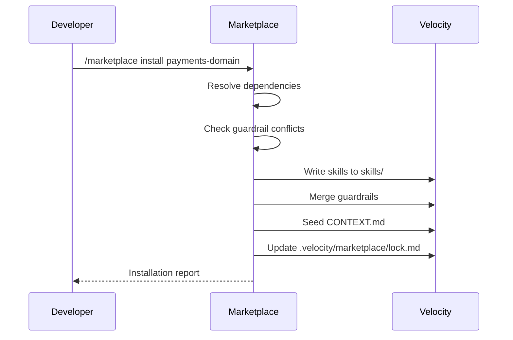

# /marketplace

Browse, install, update, and publish Velocity Marketplace packs — versioned bundles of agents, skills, guardrails, domain knowledge, and `CONTEXT.md` templates.

## What the Marketplace Does

The Marketplace is the distribution layer for Velocity extensions. Packs bundle any combination of:

- **Skills** — domain-specific or workflow skills
- **Agents** — pre-configured agent definitions
- **Guardrails** — rule sets for a vertical or compliance regime
- **Context templates** — ready-made `CONTEXT.md` seeds for known domains
- **Knowledge** — ADRs, runbooks, and incident reports from community projects

## Invocation

::: code-group

```text [Cursor]
/marketplace
```

```text [Claude Code]
/velocity-marketplace
```

```text [Copilot]
#velocity-marketplace
```

```text [Gemini]
@velocity-marketplace
```

:::

## Commands

| Command                          | Description                        |
| -------------------------------- | ---------------------------------- |
| `/marketplace search <query>`    | Search available packs             |
| `/marketplace install <pack-id>` | Install a pack                     |
| `/marketplace update`            | Update all installed packs         |
| `/marketplace list`              | List installed packs               |
| `/marketplace publish`           | Publish a local pack               |
| `/marketplace info <pack-id>`    | Show pack details and dependencies |

## Pack Structure

A Velocity pack is a directory with a `pack.yaml` manifest:

```yaml
id: "community/payments-domain"
version: "1.3.0"
description: "Payment processing domain pack — CONTEXT.md, guardrails, runbooks"
author: "velocity-community"
contents:
  skills:
    - skills/refund-flow/SKILL.md
    - skills/settlement-audit/SKILL.md
  guardrails:
    - guardrails/pci-dss.md
  context:
    - context/CONTEXT.md
  knowledge:
    - knowledge-base/adrs/
    - knowledge-base/runbooks/
dependencies:
  - "velocity-core/audit-trail@>=1.0.0"
```

## Installation Flow



## Lock File

After installation, Velocity writes `.velocity/marketplace/lock.md`:

```markdown
# Marketplace Lock

Last updated: 2024-01-15

## Installed Packs

| Pack ID                    | Version | Installed  | Source      |
| -------------------------- | ------- | ---------- | ----------- |
| community/payments-domain  | 1.3.0   | 2024-01-15 | marketplace |
| community/event-sourcing   | 0.9.2   | 2024-01-10 | marketplace |
| internal/company-standards | 2.1.0   | 2024-01-05 | local       |
```

## Publishing a Pack

To publish your own pack:

1. Create a `pack.yaml` in your pack directory
2. Run `/marketplace publish`
3. The skill validates the manifest, checks for conflicts, and generates the pack bundle
4. Submit the bundle to the Velocity community registry

## Conflict Detection

Before installing a pack, the Marketplace checks for:

- **Guardrail conflicts** — rules that contradict existing `.velocity/guardrails/default.md`
- **Skill name collisions** — duplicate skill IDs in `skills/`
- **Context term conflicts** — terms that clash with existing `CONTEXT.md` definitions

Conflicts are reported before installation; you choose to merge, skip, or abort.

## Related Skills

- [`/rule-pack-engine`](/skills/rule-pack-engine) — underlying import pipeline the Marketplace uses
- [`/init`](/skills/init) — bootstrap that auto-recommends packs for your stack
- [`/sync`](/skills/sync) — updates packs alongside core Velocity assets
